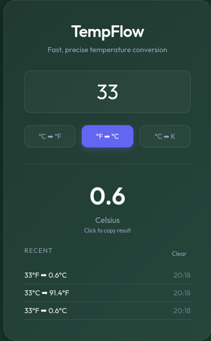

# TempFlow | Modern Temperature Conversion

**Live App: [tempflow-app.netlify.app](https://tempflow-app.netlify.app/)**

TempFlow is a sleek, fast, and responsive temperature conversion tool built with modern web technologies. It allows users to convert between Celsius, Fahrenheit, and Kelvin in real-time with a beautiful glassmorphism UI.

## ✨ Features

- **Real-time Conversion:** Results update instantly as you type.
- **Three-Way Conversion:** Support for Celsius, Fahrenheit, and Kelvin.
- **Visual Feedback:** Dynamic background colors that change based on temperature (Cold ➡ Hot).
- **Conversion History:** Keep track of your last 5 conversions.
- **Copy to Clipboard:** One-tap copying for your conversion results.
- **Fully Responsive:** Optimized for mobile, tablet, and desktop devices.
- **High Performance:** Lightweight and optimized for fast loading.

## 🚀 Deployment

This project is configured for easy deployment on **Netlify**.

1. Fork or clone this repository.
2. Connect your repository to Netlify.
3. Netlify will automatically detect the static files and the `netlify.toml` configuration.
4. Deploy and enjoy!

## 🛠️ Tech Stack

- **HTML5:** Semantic structure and SEO optimization.
- **CSS3:** Advanced styling with Glassmorphism and responsive media queries.
- **JavaScript (Vanilla):** Light and efficient logic for conversions and UI interactivity.

## 📝 License

This project is open-source and available under the [MIT License](LICENSE).
